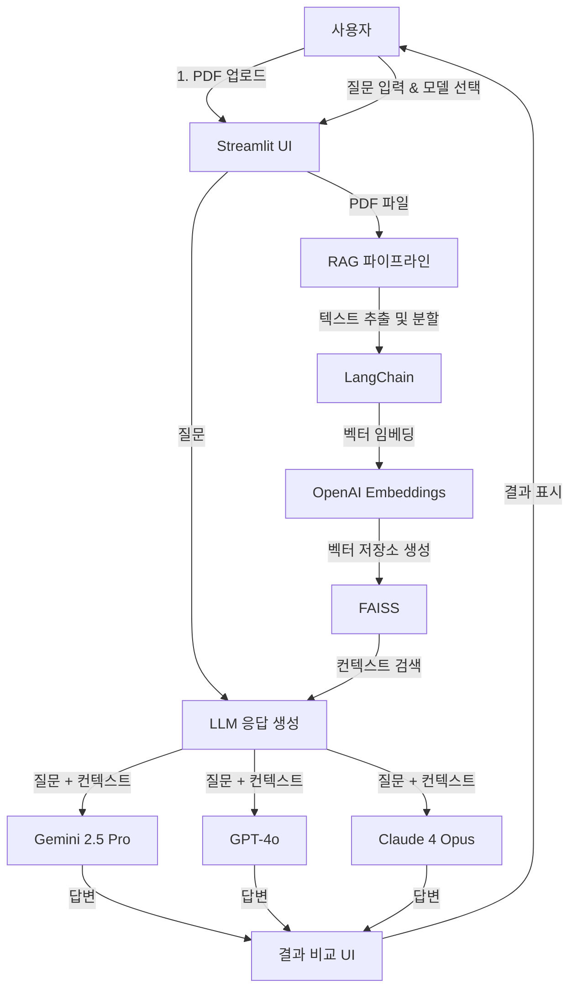

# RAG 기반 LLM 비교 평가 도구

이 프로젝트는 PDF 문서를 기반으로 여러 대규모 언어 모델(LLM)의 답변을 RAG(검색 증강 생성) 기술을 사용하여 비교하는 Streamlit 웹 애플리케이션입니다.

## 주요 기능

- **PDF 파일 업로드**: 분석하고 싶은 PDF 문서를 간편하게 업로드할 수 있습니다.
- **다중 LLM 비교**: Gemini 2.5 Pro, GPT-4o, Claude 4 Opus 등 주요 LLM들의 답변을 나란히 비교하여 성능을 평가할 수 있습니다.
- **RAG 기반 질의응답**: 사용자가 입력한 질문에 대해 PDF 문서의 내용을 기반으로 가장 관련성 높은 답변을 생성합니다.
- **응답 시간 및 출처 확인**: 각 모델의 답변 생성에 걸린 시간과 참고한 원본 문서의 컨텍스트를 함께 제공하여 답변의 신뢰도를 높입니다.

## 기술 아키텍처

애플리케이션은 다음 순서로 작동합니다.

1.  사용자가 PDF 파일을 업로드합니다.
2.  LangChain을 사용하여 문서를 텍스트 조각으로 나누고, OpenAI 임베딩 모델을 통해 벡터로 변환합니다.
3.  생성된 벡터는 FAISS 벡터 저장소에 저장됩니다.
4.  사용자가 질문을 입력하면, FAISS 저장소에서 질문과 의미적으로 가장 유사한 텍스트 조각(컨텍스트)을 검색합니다.
5.  검색된 컨텍스트와 사용자 질문을 선택된 LLM(Gemini, GPT, Claude)에 전달하여 답변을 생성합니다.
6.  각 LLM이 생성한 답변, 응답 시간, 참고 컨텍스트를 Streamlit UI에 나란히 표시하여 사용자가 비교할 수 있도록 합니다.



## 설치 및 실행 방법

1.  **저장소 복제:**
    ```bash
    git clone https://github.com/your-username/your-repository-name.git
    cd your-repository-name
    ```

2.  **필요한 라이브러리 설치:**
    ```bash
    pip install -r requirements.txt
    ```

3.  **.env 파일 설정:**
    프로젝트 루트 디렉토리에 `.env` 파일을 생성하고, 사용하는 LLM의 API 키를 추가합니다.
    ```
    OPENAI_API_KEY="sk-..."
    GOOGLE_API_KEY="..."
    ANTHROPIC_API_KEY="sk-..."
    ```

4.  **애플리케이션 실행:**
    ```bash
    streamlit run app.py
    ```

## 사용 방법

1.  터미널에서 `streamlit run app.py` 명령을 실행하여 애플리케이션을 시작합니다.
2.  웹 브라우저에서 사이드바의 '파일 업로드' 버튼을 클릭하여 분석할 PDF 파일을 업로드합니다.
3.  비교하고 싶은 LLM 모델을 체크박스에서 선택합니다.
4.  화면 하단의 채팅 입력창에 PDF 내용과 관련된 질문을 입력하고 Enter 키를 누릅니다.
5.  잠시 기다리면 선택한 모델들의 답변이 나란히 표시됩니다.